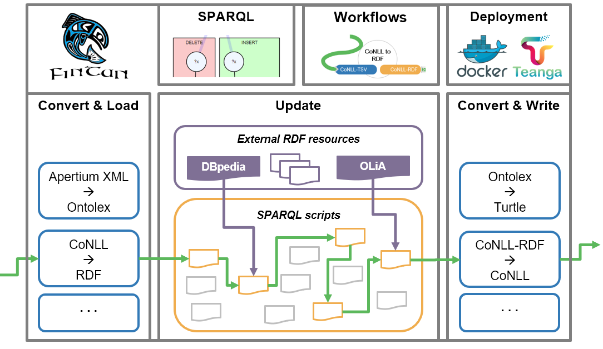

[back to top](README.md)

# Fintan software concept
This directory contains the documentation for the Fintan-backend and how to build and run it as a stand-alone software. It furthermore describes how to use Fintan in your own applications or create your own custom modules.

## Software platform 

The Fintan platform is an effort of combining existing converter frameworks with stream-based graph transformation (as originally developed in the context of [CoNLL-RDF](https://github.com/acoli-repo/conll-rdf) and a workflow management engine in order to create integrated transformation pipelines for various input and output formats. By making data conversion modular, we increase the reusability of granular transformation steps. By choosing a stream-based approach, specifically for processing RDF data, we also address scalability issues typically arising with large scale datasets on triple stores. 

The Fintan platform encompasses:
* An interoperable pool of processing components
    * External converter tools 
    * Stream-based graph processing for RDF
    * Serializer tools and data writers
* A development environment for SPARQL updates and transformation workflows
* A means of deploying specific converter pipelines as integrated Docker containers

## Architecture and Implementation

Fintan comprises a modular architecture with several repositories reflecting four interdependent layers which are addressed in the subsequent sections.

### [Fintan Core API](https://github.com/acoli-repo/fintan-core)
The Fintan Core API is designed to provide the minimal abstraction layer and functional core classes for using stream-based graph processing and running Fintan-compliant pipelines. Since it has a minimal amount of dependencies it can easily be built and imported as a Maven dependency by independent projects.

We define `FintanStreamComponent` as the primary class to host a data transformation component. Each component can be run as an independent thread and allows for an indefinite amount of input and output stream slots which are designed to correspond to a specific graph for data processing. Like with RDF graphs, there is a default stream slot and multiple named stream slots, which should follow a valid URI schema. Hereby Fintan distinguishes between two types of streams:

* **Generic streams:** this can be any kind of stream supplied by an input file. Typically, this will be a machine-readable, formal representation of data, such as XML, CSV formats or RDF serializations (RDF/XML, Turtle etc.) Depending on their internal order and structure, they could already be considered segmented, as long as they can be easily split by a delimiter, such as an empty line between segments.
* **Segmented RDF:** is a stream of pre-loaded RDF models. Each model should correspond to a self-contained segment of the underlying data which can be processed independently.

Depending on the types of streams they accept as input or output, Fintan distinguishes four core classes corresponding to types of operation for components:
 
* **GenericIO** components *read and write generic streams* of data. They function as a baseline abstraction layer which can incorporate almost any existing transformation tool. 

* **Loader** components *read any kind of input data* and *write back a segmented stream of RDF data* for stream-based graph transformation. In the Core API, there is a default Loader which reads RDF serializations which are already segmented by a configurable segment delimiter. For completely unstructured RDF serializations, an additional **Splitter** component can be used to construct a segmentation. 

* **Update** components *read streams of segmented RDF data*, process multiple data segments in parallel and then *write back the transformed RDF segments*. They are defined by a set of SPARQL scripts and additional resources to be permanently side-loaded for specific processing steps, e.g. inferring annotation schemes by using [OLiA](http://purl.org/olia) or entity linking to [DBpedia](https://www.dbpedia.org/) entries .

* **Writer** components *read segmented RDF data* and *write back generic output*, e.g. RDF serializations (e.g. Turtle, RDF/XML) or export the data to other output formats.

Finally, the `FintanManager` class provides methods for constructing pipelines from JSON configuration files, as well as a basic CLI. The Core API is designed to host and run any component extending one of the four core classes. Importing the Core API to another project and creating a custom component as a subclass, while adhering to the general design principles, will immediately allow it to be integrated into Fintan pipelines.

### [Fintan backend](https://github.com/acoli-repo/fintan-backend)
While the aforementioned classes are central functionalities provided by the Fintan Core, many of the Loader and Writer modules can be external programs published in other repositories. In order for them to become fully Fintan-compliant, they must implement the respective interfaces and make the source code available as a Maven module.

By using Maven dependencies, they can be directly imported into Fintan as External API modules. On the other hand, Fintan can be directly used within their respective toolset. The Fintan backend repository serves as a wrapper for compliant API modules and contains a script which checks out and builds all verified dependencies or submodules.

### [Fintan service](https://github.com/acoli-repo/fintan-service)
In order to add alternative methods of interacting with Fintan and facilitate its ease of integration into larger workflows, we have implemented Fintan Service, an OpenAPI-compatible web service that provides a REST API for executing Fintan pipelines. To simplify the deployment process, we provide Docker containers encapsulating the service. There are two flavours in which this service is distributed:

1. A container that provides an API capable of running any pipeline and provides endpoints for uploading new pipelines and data required for running them.
2. Containers, tailored for each particular task. In this scenario, the API in the container provides the only endpoint, for running the pipeline for which it was built. This scenario is designed for the ease of use in larger workflows, such as those built with Teanga.

Both scenarios provide possibilities for running pipelines in both synchronous and asynchronous regimes. More specifically, Fintan Service provides a user with APIs with the following endpoints:

* `/api/run` — executes a pipeline and either returns the result (synchronous mode) or a link to the tasks queue (asynchronous mode)
* `/api/upload` — an endpoint that allows the user to upload additional pipelines and data required for the pipelines to run;
* `/api/docs` — Swagger UI visualising OpenAPI specification of the API.

### [Fintan User Interface](https://github.com/acoli-repo/fintan-ui)
Fintan also provides a web application for workflow management which can be employed to develop [transformation pipelines](2-run-pipelines.md).

