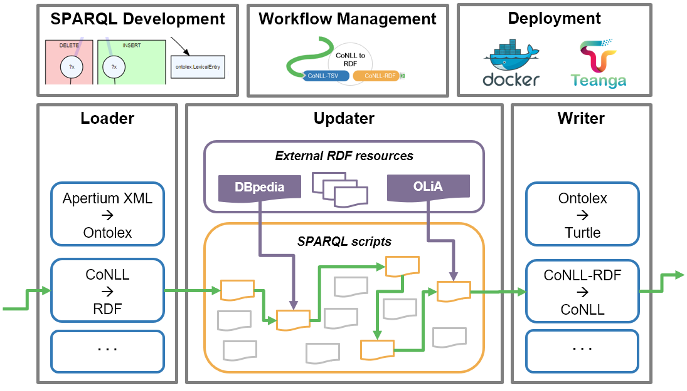
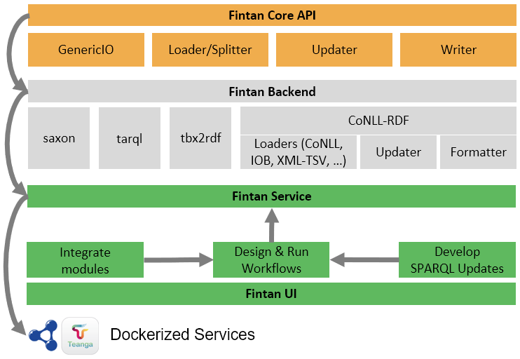

[back to top](README.md)

# Fintan software concept
This directory contains the documentation for the Fintan-backend and how to build and run it as a stand-alone software. It furthermore describes how to use Fintan in your own applications or create your own custom modules.

## Software platform 

The Fintan platform is an effort of combining existing converter frameworks with stream-based graph transformation (as originally developed in the context of [CoNLL-RDF](https://github.com/acoli-repo/) and a workflow management engine in order to create integrated transformation pipelines for various input and output formats. By making data conversion modular, we increase the reusability of granular transformation steps. By choosing a stream-based approach, specifically for processing RDF data, we also address scalability issues typically arising with large scale datasets on triple stores. 

## Architecture and Implementation

In order to achieve these implementation goals, we designed a modular architecture which aids a decentralized development process. With Fintan inheriting some of the core functionalities from CoNLL-RDF, we decided to keep the general design paradigms intact and stay within the Java-based environment including the Apache Jena API for graph transformation. However, since CoNLL-RDF is designed as a self-contained tool which is focused on TSV-based input formats, Fintan establishes an additional abstraction layer. 

The Fintan architecture comprises four interdependent layers which are addressed in the subsequent sections (cf. Figure 5).

### Fintan Core API
The Fintan Core API defines four distinct classes which encapsulate methods for data streaming and ensure their interoperability:
 
* **GenericIO** modules read and write any kind of streamed data. They function as a baseline abstraction layer which can incorporate almost any existing transformation tool. 

* **Loader** modules read any kind of input data and write back a segmented stream of RDF data for stream-based graph transformation. In the Core API, there is a default Loader which reads presegmented RDF serializations which are splitted by a configurable segment delimiter. For completely unstructured RDF serializations, an additional Splitter module can be used to construct a segmentation. 

* **Update** modules are performed by Updater classes which read streams of RDF data, process multiple data segments in parallel and then write back the transformed RDF data. Update modules are defined by a set of SPARQL scripts and additional resources to be permanently side-loaded for specific processing steps, e.g. inferring annotation schemes by using OLiA (Chiarcos and Sukhareva, 2015) or entity linking to DBpedia (Auer et al., 2007) entries .

* **Writer** modules read RDF data and either create serializations (e.g. Turtle, RDF/XML) or export the data to other output formats.

All four classes are subclasses of FintanStreamComponent which is generically typed to eventually be able to host additional types of streams. Finally, the FintanManager class provides methods for constructing pipelines from JSON configuration files, as well as a basic CLI. The Fintan core API is designed to provide the minimal abstraction layer and functional core classes for using stream-based graph processing and running Fintan-compliant pipelines. Since it has a minimal amount of dependencies it can easily be built and imported as a Maven dependency by independent projects.

### Fintan backend
While the aforementioned classes are central functionalities provided by the Fintan Core, many of the Loader and Writer modules can be external programs published in other repositories. In order for them to become fully Fintan-compliant, they must implement the respective interfaces and make the source code available as a Maven module.

By using Maven dependencies, they can be directly imported into Fintan as External API modules. On the other hand, Fintan can be directly used within their respective toolset. The Fintan backend repository serves as a wrapper for compliant API modules and contains a script which checks out and builds all verified dependencies or submodules.

### Fintan service

### Fintan UI
