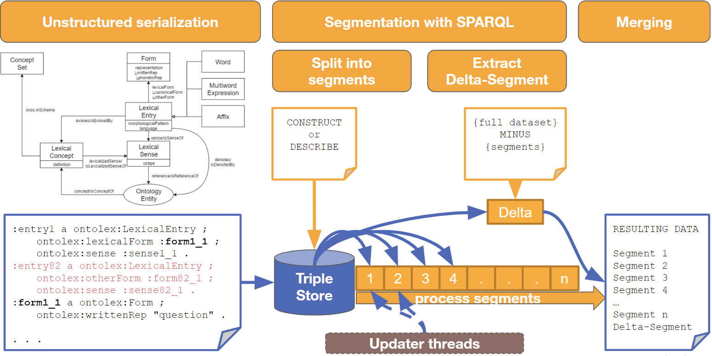

[back to top](README.md)

# Core components

As described in [Software concept](1-software-concept.md), Fintan primarily utilizes 4 abstract classes to define its components:
`StreamTransformerGenericIO` for processing serialized RDF or generic data
`StreamLoader` to produce segmented RDF streams from serialized or generic data
`StreamRdfUpdater` to transform segmented RDF streams
`StreamWriter` to produce serializations or exports from segmented RDF streams

")

The class diagram depicts how they interact with the Core API. The FintanManager instantiates a FintanStreamComponent by using its respective Factory interface. The `FintanStreamComponent` is generically typed for input and output but provides methods for handling named and default input and output streams. A `FintanStreamComponent` can be started by calling its `start()` method. The four main interface classes described above then specify the typing of their accepted I/O streams. 

In this section we will now describe the functional components implementing these abstract classes and interfaces.


## StreamDuplicators
`StreamDuplicators` provide the most basic functionality. They just copy the content of their respective default input stream to all of their attached output streams. Therefore they do not accept named input streams. They are necessary for processing the same data with independent components or for just piping out intermediate results to files.

As Fintan currently supports two types of streams, there are two separate Duplicators:
`IOStreamDuplicator` for regular text streams
`RDFStreamDuplicator` for segmented RDF streams

## RDF Loader and Splitter
At the time of writing, the Fintan core supports two types of Loaders. The most basic one is the RDFStreamLoader which expects presegmented RDF data as an input stream. For convenience, multiple input and output streams can be supplied to a single Loader configuration. In this case the data read from one input stream will be transformed and piped out to the output stream of the same name.

It has three parameters which can be set in the JSON config:

`lang` to specify the RDF syntax. Supported languages follow the naming convention of Apache Jena (ttl, TURTLE, RDF/XML, N3, …)
`delimiter` to specify the textual delimiter indicating the end of a segment. The specified delimiter is always expected to be the full content of a delimiting line of text. "" corresponds to an empty line.
`globalPrefixes` (`true`/`false`) is specifically designed for Turtle syntax. In a Turtle file, usually the prefixes are defined globally in the beginning of the File. However, they can be overridden in between. Without the `globalPrefixes` setting Fintan expects the prefixes to be repeated for every segment of data. If it fails to load, it will still retry with the last successful set of prefixes, but this will increase processing overhead. In this case the `globalPrefixes` flag should be set to `true`.

The following example shows properly segmented Turtle data. Each `LexicalEntry` and all its adjacent nodes are listed in blocks delimited by an empty line:

```
:entry1 a ontolex:LexicalEntry ;
    ontolex:lexicalForm :form1_1 ;
:form1_1 a ontolex:Form ;
    ontolex:writtenRep "question" .

:entry2 a ontolex:LexicalEntry ;
    ontolex:otherForm :form2_1 ;
:form2_1 a ontolex:Form ;
    ontolex:writtenRep "answer" .
```

This can be consumed by a `RDFStreamLoader` configured as follows:

```
{ 
     "class" : "RDFStreamLoader",
     "lang" : "ttl",
     "delimiter" : ""
}
```

In contrast, the `RDFStreamSplitterTDB` class also functions as a Loader but is designed for processing completely unsegmented RDF serializations (e.g. exports from other databases, triple stores etc.) An RDF graph may not be coherently serialized in a way that it can be processed by the default `RDFStreamLoader`. The following example shows serialization of an OntoLex-Lemon dictionary, in which a Form is directly linked to its respective `LexicalEntry` but serialized after a completely unrelated other `LexicalEntry`. 

```
:entry1 a ontolex:LexicalEntry ;
    ontolex:lexicalForm :form1_1 ;
:entry232 a ontolex:LexicalEntry ;
    ontolex:otherForm :form232_1 ;
:form1_1 a ontolex:Form ;
    ontolex:writtenRep "question" .
```

For this type of data, the full graph needs to be assessed as-is and prepared for segmentation, so the subsequent Updater threads can process them in parallel.




The figure above depicts the general principle of the Splitter and Updater architecture. The `RDFStreamSplitterTDB` employs a triple store which can hold multiple graphs in their entirety and derive digestible segments from them. The `RDFUpdater` can then process these segments (e.g. transform annotations etc.) and write back the updated dataset in the same order, in which the segments have been created.

For splitting data into segments, the Splitter employs two distinct modes:
* `ITERATE_CONSTRUCT` mode uses a select query as an iterator (e.g. for all LexicalEntries in a graph) and a construct query to create isolated models for each of the seed elements (i.e. instances of LexicalEntry). Each resulting graph is then streamed to its respective output stream. The result variables of the iterator query must be referenced in the construct query by wildcards:
    * `?var1` in the iterator query corresponds to `<?var1>` in the construct query
    * the `<?var1>` wildcard is then dynamically replaced by the actual values of the query results for each iteration.
* `RECURSIVE_UPDATE` mode instead uses SPARQL updates to construct the result models within distinct result graphs. The Update must be designed in a way that it “consumes” the source graphs, i.e it should delete the data it writes to the result graphs from the source graphs. After each processing step, all target graphs are emptied after supplying their content to the output streams. The update is repeated until it produces only empty target graphs. 

Given the write penalties associated with SPARQL updates, `RECURSIVE_UPDATE` can be slower, but is more powerful in constructing multiple graphs at the same time, traversing complex property paths and being able to easily export unused deltas, which have never been addressed in any segment. Both modes are mutually exclusive and cannot be combined.

The Splitter has the following parameters which can be set in the JSON config:
* `lang` to specify the RDF syntax. Supported languages follow the naming convention of Apache Jena (ttl, TURTLE, RDF/XML, N3, …)
* `tdbPath` to specify a custom directory to create the temporary TDB database
* `iteratorQuery` for `ITERATE_CONSTRUCT` mode. Must be a select query. 
* `constructQuery` for `ITERATE_CONSTRUCT` mode. Must be a construct or describe query. 
* `initUpdate` for `RECURSIVE_UPDATE` mode. Optional update which is executed a single time at startup to initialize the recursion (e.g. to insert a “next” marker.)
* `recursiveUpdate` for `RECURSIVE_UPDATE` mode. Repeated until it produces empty target graphs.
* `segmentStreams` for `RECURSIVE_UPDATE` mode specify which of the target graphs host the target segments. Only these graphs are streamed after each recursion.
* `deltaStreams` for `RECURSIVE_UPDATE` mode specifies a list of graphs whose content should be streamed after the last recursion.

## RDF Updater
The `RDFUpdater` class shares much of its baseline implementation and arguments with the preexisting `CoNLLRDFUpdater`. It is, however, not specifically tailored towards processing CoNLL-RDF. Instead of a stream of serialized CoNLL-RDF data, it directly consumes and produces Fintan’s segmented RDF streams, thus enabling it to work with any kind of RDF data. The basic processing principles are as follows:

* compile the set of provided update scripts 
* prefetch external resources needed to process the streamed data (e.g. OLiA models). They can be supplied either as files or URLs, or as named input streams. External models are always fully consumed and stored before the actual transformation of segments starts.
* read segments of the default input stream, buffer them in-order and distribute them across available parallel worker threads.
* each parallel worker thread for executes all provided updates in-order (optionally iterated multiple times, until no further changes occur) for one segment
* output the transformed segments in-order, as soon as a complete sequence is available in the buffer.

This allows for complex (and even recursive) updates which produce a lot of overhead on large databases to be executed on multiple small fragments of data at the same time, and, depending on the use case, can provide a large performance increase due to reduced processing and memory overhead and a better usage of available processing power.

The following parameters can be used to configure RDFUpdater instances:
* `threads` is an optional parameter to specify the maximum amount of parallel worker threads. If it is unspecified or less than 1, it defaults to the amount of CPU cores available to the runtime.
* `lookahead = N` allows to specify a number of subsequent segments to be precached before processing the next segment. Within the respective SPARQL updates, the content of the next N segments is available in the graph: `https://github.com/acoli-repo/conll-rdf/lookahead`
* `lookback = N` in turn allows to specify a number of preceding segments to be precached before processing the next segment. Within the respective SPARQL updates, the content of the previous N segments is available in the graph: `https://github.com/acoli-repo/conll-rdf/lookback`
* `updates` must be defined as an array of multiple SPARQL updates to be executed per segment in the order they are provided. Each update is defined by the following parameters:
    * `path` to the update, can be relative to the execution directory
    * `iter` optionally defines the number of iterations for each update. By default, it is executed a single time. `u` or `*` allow infinite iterations. Update execution always stops as soon as no further changes occur.
* `models` can optionally be defined as an array of multiple RDF resources. Each resource is defined by the following parameters:
    * `source` is the path or URL where this resource can be found
    * `graph` optionally defines the graph into which this resource is loaded. If no graph is specified, the URL denoting the location of the resource is used as the graph name.
    * apart from the `models` parameter, it is possible to supply external models as named input streams. They will be loaded to a graph corresponding to the name of the input stream.
* `triplesoutDIR` optionally enables a debugging output of a segment after each single update operation. The Output is always in `NTRIPLES` format. If no directory is specified, the option is deactivated.
    * `triplesoutSNT` defines an array of segments to be debugged. If no segment is specified, only the first segment is debugged. The segment list must contain the local name of a segment identifier (e.g. the instance of a LexicalEntry or nif:Sentence)
    * `triplesoutSNTclass` defines the class of the segment identifiers. Since this option was originally designed for CoNLL-RDF it defaults to nif:Sentence for backward compatibility.

## RDF Writer 
After the graph transformation has been applied, the RDFStreamWriter class can export segmented RDF streams into commonly used serializations. For convenience, multiple input and output streams can be supplied to a single Writer configuration. In this case the data read from one input stream will be transformed and piped out to the output stream of the same name.

It has the following parameters which can be set in the JSON config:

* `lang` to specify the target RDF syntax. Supported languages follow the naming convention of Apache Jena (ttl, TURTLE, RDF/XML, N3, …)
* `delimiter` to specify the textual delimiter indicating the end of a segment. The specified delimiter is always expected to be the full content of a delimiting line of text. "" corresponds to an empty line.
* `prefixDeduplication` (`true`/`false`) can be set to remove duplicate prefix declarations in Turtle syntax. Since in Fintan, each segment is contained in its own model, by default, the Jena API repeatedly outputs all prefixes for each segment. With this flag, the duplicates are removed from the resulting text stream.

## Create custom exports (C/TSV, …) using SPARQL queries
Apart from regular RDF serializations, it is possible to create complex tabular exports using SPARQL queries. For this purpose, two distinct classes are available:

* `SparqlStreamWriter` is a typical Writer class and takes segmented RDF streams as an input. Like the `RDFStreamWriter`, it executes the query per segment and can output the results separated by a segment delimiter. For convenience, multiple input and output streams can be supplied to a single Writer configuration. In this case the data read from one input stream will be transformed and piped out to the output stream of the same name.
* `SparqlStreamTransformerTDB` in contrast shares some common properties with the `RDFStreamSplitterTDB`. It can consume multiple streams of serialized RDF data (in a given lang), store them into a temporary TDB (at a given tdbPath) and query across all graphs at once. Named input streams are stored into the graph of the same name. For outputting the query results only the default stream is supported.

Both classes do share, however, an extensive range of possible output formats. All possible serializations of query results in the Apache Jena library are supported. On top of that, it is possible to define custom CSV exports. The following JSON parameters are common for both of them:
* `query` to define the path to the SPARQL query
* `outFormat` can be used to denote a preconfigured output format. It can be either a Jena format (such as `TSV`) or `CoNLL` (which is a preconfigured custom Format). If no `outFormat` is specified, a custom format can be applied with the following parameters.
* `escapeChar` for escaping functional characters 
* `delimiterCSV` for the column delimiter. `\t` for CoNLL
* `quoteChar` optional for wrapping cell content
* `emptyChar` optional to denote an empty cell. `_` for CoNLL