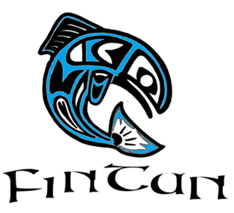
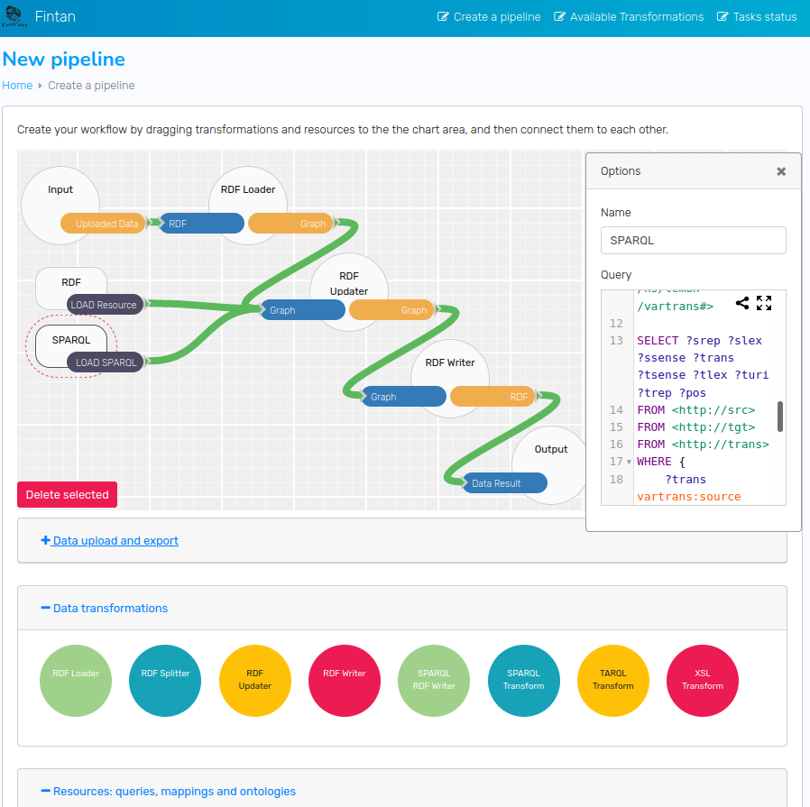

# Software Documentation
The Fintan platform is an effort of combining existing converter frameworks with stream-based graph transformation and a workflow management engine in order to create integrated transformation pipelines for various input and output formats.



## Table of Contents:

[Quick Start Guide](quick-start.md)

[1. Software concept](1-software-concept.md)

[2. Developing and running pipelines](2-run-pipelines.md)

[3.a Fintan Core Components](3a-core-components.md)

[3.b Fintan Backend Components](3b-backend-components.md)

[3.c Build your own Components](3c-build-custom-components.md)

## Repositories
- [**Frontend**](https://github.com/acoli-repo/fintan-ui) for designing Fintan pipelines
- [**Service**](https://github.com/acoli-repo/fintan-service) for running Fintan pipelines inside integrated Docker containers
- [**Backend**](https://github.com/acoli-repo/fintan-backend) for executing Fintan pipelines on the command line
	- includes [**Core API**](https://github.com/acoli-repo/fintan-core) for stream-based graph processing.
	- wraps fully integrated converter components

## Authors and Maintainers
* **Christian Fäth** - faeth@em.uni-frankfurt.de
* **Christian Chiarcos** - chiarcos@informatik.uni-frankfurt.de
* **Maxim Ionov** 
* **Leo Gottfried** 

See also the list of [contributors](https://github.com/acoli-repo/fintan-doc/graphs/contributors) who participated in this project.

## Reference
Fäth C., Chiarcos C., Ebbrecht B., Ionov M. (2020), Fintan - Flexible, Integrated Transformation and Annotation eNgineering. In: Proceedings of the 12th Language Resources and Evaluation Conference. LREC 2020. pp 7212-7221.

## Acknowledgments
This repository has been created in context of
* Applied Computational Linguistics ([ACoLi](http://acoli.cs.uni-frankfurt.de))
* Prêt-á-LLOD. Ready-to-use Multilingual Linked Language Data for Knowledge Services across Sectors ([Pret-a-LLOD](https://cordis.europa.eu/project/id/825182/results))
  * Research and Innovation Action of the H2020 programme (ERC, grant agreement 825182)
  * In this project, [CoNLL-RDF](https://github.com/acoli-repo/conll-rdf) has been applied/developed/restructured to serve as backend of the Flexible Integrated Transformation and Annotation Engineering ([FINTAN](https://github.com/Pret-a-LLOD/Fintan)) Platform.

## Licenses
The repositories for Fintan are being published under multiple licenses. All native code and documentation falls under an Apache 2.0 license. [LICENSE.main](LICENSE.main.txt). The examples in the backend repository contain data and some SPARQL scripts from external sources: CC-BY 4.0 for all data from universal dependencies and SPARQL scripts from the CoNLL-RDF repository, see [LICENSE.data](LICENSE.data.txt). The included Apertium data maintains its original copyright, i.e., GNU GPL 3.0, see [LICENSE.data.apertium](LICENSE.data.apertium.txt). Code from external dependencies and submodules is not redistributed with this package but fetched directly from the respective source repositories during build process and thus adheres to the respective Licenses. 

### LICENSE.main (Apache 2.0)
```
├── https://github.com/acoli-repo/fintan-doc/ 
├── https://github.com/acoli-repo/fintan-core/  
├── https://github.com/acoli-repo/fintan-backend/
│	└──[ see exceptions below ]
├── https://github.com/acoli-repo/fintan-service/ 
└── https://github.com/acoli-repo/fintan-ui/ 
```
### LICENSE.data (CC-BY 4.0)
```
└── https://github.com/acoli-repo/fintan-backend/  
	├── samples/conll-rdf/  
	│	└──[ all scripts and data ]
	└── samples/splitter/  
		├── en-ud-dev.conllu.gz.linked.ttl
		├── en-ud-tiny.conllu.gz.linked.ttl
		└── en-ud-train.conllu.gz.linked.ttl
```
### LICENSE.data.apertium (GNU GPL 3.0)
```
└── https://github.com/acoli-repo/fintan-backend/  
	└── samples/xslt/apertium/data
```

Please cite *Fäth C., Chiarcos C., Ebbrecht B., Ionov M. (2020), Fintan - Flexible, Integrated Transformation and Annotation eNgineering. In: Proceedings of the 12th Language Resources and Evaluation Conference. LREC 2020. pp 7212-7221.*.
