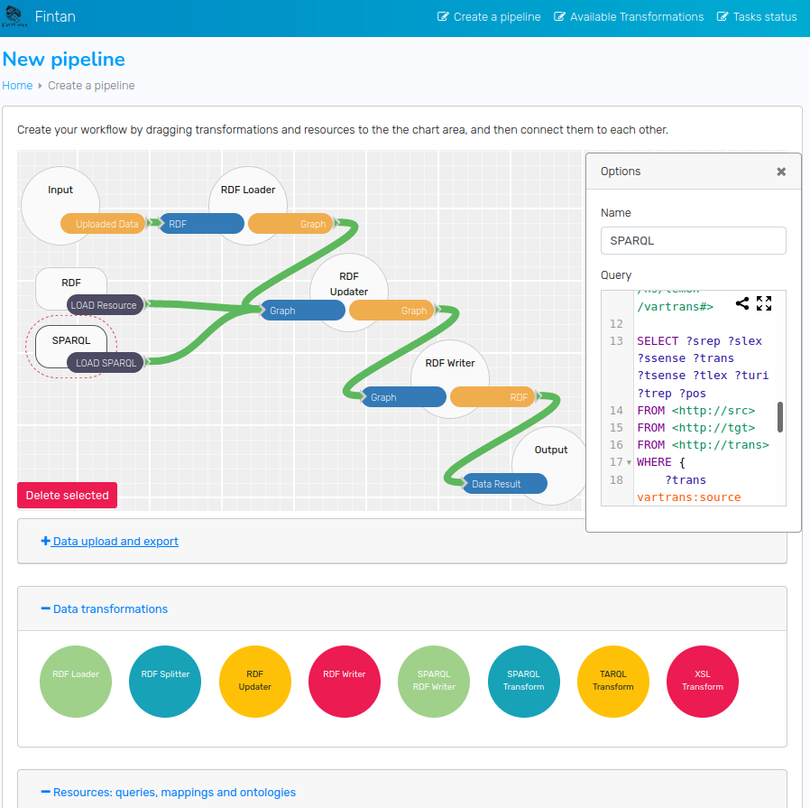

[back to top](README.md)

# Develop and run pipelines

## JSON configurations and I/O
For writing pipelines, Fintan uses an extended version of the JSON configuration schema used for CoNLL-RDF. Simple pipelines with a single stream of data can still adhere to the original format. Fintan is thus backward compatible with all existing CoNLL-RDF pipelines:

* Define `input` as a path or URI to read from. Optionally, `System.in` reads from shell input.
* Define `output` as a path to write to. Optionally, `System.out` writes to the shell’s standard out.
* Define `pipeline` as a list of configured components. The parameters are specific for each component. The output of one component is used as the input for the subsequent component. The first component will read from input, the last component will write to output. 

The following example shows a pipeline which reads unsegmented RDF data from a file, splits it into segments and writes Turtle format with segment delimiters to the standard shell output.

```
{
"input" : "en-ud-train.conllu.gz.linked.ttl"
, "output" : "System.out"
, "pipeline" : [ 
    { 
      "class" : "RDFStreamSplitter",
      "lang" : "ttl",
      "iteratorQuery" : "iterate_sentences.sparql",
      "constructQuery" : "construct_sentences.sparql",
      "tdbPath" : null
    },
    { 
      "class" : "RDFStreamWriter",
      "lang" : "ttl",
      "delimiter" : "##TEST#OUTPUT##"
    }
  ]
}
```

In contrast to CoNLL-RDF, Fintan not only allows for a single stream to be processed, but is able to split and merge streams. Hereby, each FintanStreamComponent allows for an indefinite amount of input and output stream slots which are designed to correspond to a specific graph for data processing. Like with RDF graphs, there is a default stream slot and multiple named stream slots, which should follow a valid URI schema, at least for components which directly process RDF data (Updaters, the output of Loaders, and the input of Writers).

To accommodate multiple streams, two additional arrays were added to the configurations schema:
* The `components` array is a list of isolated instances of FintanStreamComponent. The general syntax is like the original pipeline array, with the only difference being that neither component’s default stream slot is linked. It is furthermore required that each instance gets an additional unique componentInstance identifier, so it can be addressed from within the streams array. The identifier is optional for the original pipeline array.
* The `streams` array in turn connects the components by using the following attributes: 
    * `readsFromInstance`: the identifier of the componentInstance to read from.
    * `readsFromInstanceGraph`: the output stream slot / graph //of the componentInstance to read from. `null` or undefined corresponds to the default graph / slot
    * `readsFromSource`: can be a path/URL or `System.in` (same as input, excludes the other two read options)
    * `writesToInstance`: the identifier of the componentInstance to read from.
    * `writesToInstanceGraph`: the input stream slot / graph of the componentInstance to write to. `null` or undefined corresponds to the default graph / slot
    * `writesToDestination`: can be a path to a file or `System.out` (same as output, excludes the other two write options)

The following example pipeline, like the previous example, also splits unsegmented RDF data into segments, but with two major differences:
* It does not apply the iterate-select method of the RDFStreamSplitter, but rather uses the recursive-update method which reads data from a set of input graphs and constructs the output in specified output graphs. This requires named stream slots to be connected to the respective graphs.
* It therefore uses the components and streams arrays to define the pipeline and connect the named stream slots. Input and Output remain the same.

```
{
"components" : [ 
    { 
     "componentInstance" : "sentenceSplitter",
     "class" : "RDFStreamSplitter",
     "lang" : "ttl",
     "initUpdate" : "update_init_construct_sentences.sparql",
     "recursiveUpdate" : "update_rec_construct_sentences.sparql",
     "tdbPath" : null
    },
    { 
      "componentInstance" : "ttlWriter",
      "class" : "RDFStreamWriter",
      "lang" : "ttl",
      "delimiter" : "##TEST#OUTPUT##"
    }
  ]
, "streams" : [
    {
      "readsFromSource" : "en-ud-train.conllu.gz.linked.ttl",
      "writesToInstance" : "sentenceSplitter",
      "writesToInstanceGraph" : "http://input"
    },
    {
      "readsFromInstance" : "sentenceSplitter",
      "readsFromInstanceGraph" : "http://output",
      "writesToInstance" : "ttlWriter"
    },
    {
      "readsFromInstance" : "ttlWriter",
      "writesToDestination" : "System.out"
    }
  ]
}
```

It is possible to mix both configuration syntaxes, which may be useful e.g. for many pipelines which only use the default streams, but pipe out intermediate results to files. For this case, the main pipeline will stay within the pipeline array, but additional streams or components can be added and connected to it as well.

## Running pipelines with parameters
Since Fintan is designed to work both within integrated containers and as a CLI tool to be integrated in existing complex workflows, the FintanManager and the JSON configurations additionally support parameterization. Within any preconfigured pipeline, it is possible to define wildcards for command line arguments which will be replaced during runtime:
* `<$param0>` for the first command line argument
* `<$param1>` for the second command line argument
...

Example taken from the [Apertium demo](https://github.com/acoli-repo/fintan-backend/blob/master/samples/xslt/apertium/_apertium_demo.sh): 

```
  "components" : [
    ...
    { 
    "componentInstance" : "dix2src",
    "class" : "XSLTStreamTransformer",
    "xsl" : "dix2src-ttl.xsl LANG=<$param1> dc_source=<$param0>"
    },
    { 
      "componentInstance" : "dix2tgt",
      "class" : "XSLTStreamTransformer",
      "xsl" : "dix2tgt-ttl.xsl LANG=<$param2> dc_source=<$param0>"
    },
    ...
```

To run a Fintan pipeline on the command line, you only need to adhere to the following steps, which are also described in the Fintan backend repository:


* git clone the Fintan backend:

```
git clone https://github.com/acoli-repo/fintan-backend.git
```

* build the backend with all its dependencies:

```
cd fintan-backend/
. build.sh
```

* run the pipeline above:

```
. run.sh -c samples/xslt/apertium/_demo-apertium-full-with-tiad.json -p https://github.com/apertium/apertium-trunk.git en es
```

The -c option defines the JSON configuration, while the -p option defines the parameters.

## Workflow manager
In order to make the process of creating transformation pipelines and corresponding docker containers accessible to a wider audience, we have implemented a way to create these pipelines and containers visually. Fintan UI is a web application designed to be run locally. It allows creating complex pipelines in a simple drag-and-drop fashion. Despite this apparent simplicity, it requires knowledge of Fintan architecture since it is up to a user to set up all the properties for each component and write corresponding SPARQL queries for transformations and conversions.



The UI consists of 3 main parts:

* Drag-and-drop pipeline creator;
* A list of existing pipelines exported and running on a Fintan Service;
* Task progress for pipelines started asynchronously.

A page for creating pipelines contains three groups of elements a user can put as a part of their pipeline:

* **Data import and export:** this is a set of file upload and save operations that are happening outside of Fintan and the pipeline for Fintan just contains paths to where they were uploaded and paths where to save them.
* **Data transformations:** these elements roughly correspond to Fintan classes and perform data conversion and transformation steps.
* **Resources:** these are additional resources that are used by components of the second group. Examples of this group are: SPARQL queries for RDFUpdater or RDFStreamSplitterTDB, external ontologies and mappings.

For each element, there is a set of options that can be set in a pop-up window that can be revealed by clicking on an element. These options correspond to the ones described in Fintan documentation as parameters for each class, with a notable exception: SPARQL queries are not set as options but instead are represented as resource elements connected to corresponding transformation elements.
SPARQL queries can be written directly in the UI in the option window of a corresponding resource with YASQE, a text editor with syntax highlighting and autocomplete for SPARQL.

After the pipeline is created, a transformation workflow can be created by clicking “Generate”. Here a user can choose whether they want to …

* download everything they need to build a Docker container with  this pipeline running,
* run the pipeline on Fintan service running locally,
* or just download the JSON for the pipeline.					

The list of all transformation workflows available on the Fintan service can be accessed on the page “Available transformations”. Tasks that were started asynchronously can be viewed on the third page, “Tasks status”.

In addition to building workflows in Fintan UI, the development of graph transformation steps can be aided by [SparqViz](https://github.com/acoli-repo/sparqviz), a tool for creating visualizations of SPARQL queries and updates using GraphViz and the underlying dot format. A REST API accepts a SPARQL query and outputs a dot file and an SVG image. An exemplary lightweight editor website is included with the latest stand-alone version.
